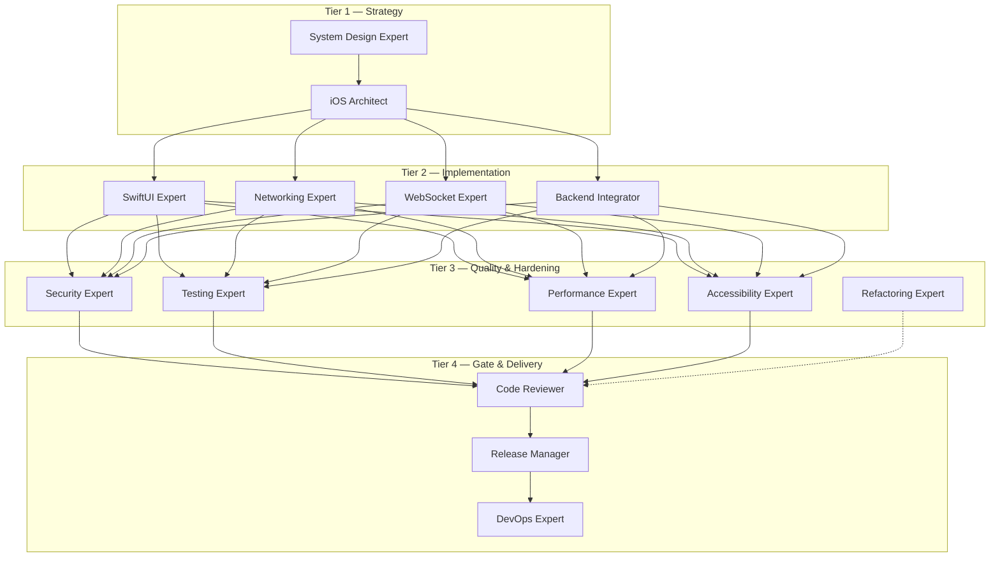
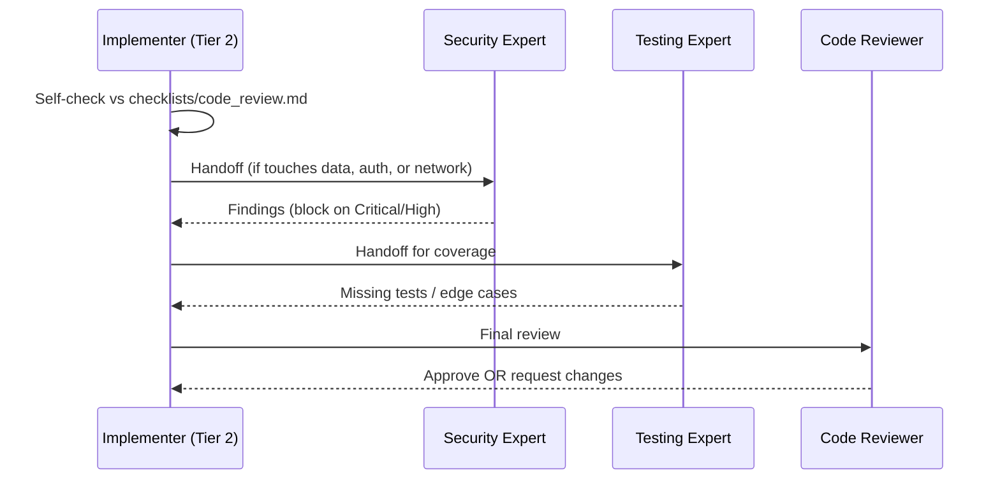
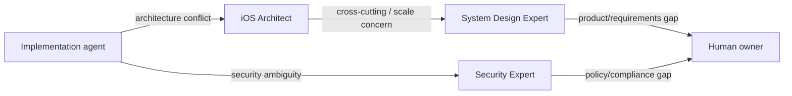

# AGENTS.md — Master Orchestration

This file defines how the agents in [`agents/`](agents/) collaborate. It is the
control plane of the toolkit: it describes the **agent hierarchy**, **task routing
rules**, **review flow**, **escalation flow**, and **multi-agent workflows**.

AI platforms that auto-load `AGENTS.md` (e.g. Codex) read this first. Other platforms
should load it alongside `README.md` when coordinating multi-step work.

---

## Operating Principles (apply to every agent)

1. **Architecture first.** Default to Clean Architecture (Domain / Data / Presentation)
   with MVVM in the Presentation layer. Respect SOLID.
2. **Security is a requirement, not a feature.** Follow [`standards/security_standards.md`](standards/security_standards.md)
   and OWASP MASVS. Never log secrets; never store tokens in plaintext.
3. **Make it testable.** Inject dependencies through protocols. No hidden singletons in
   business logic.
4. **Be explicit about errors and concurrency.** Use typed errors and Swift Concurrency
   (`async/await`, actors) deliberately.
5. **Stay consistent.** Conform to [`standards/`](standards/). Generated code should look
   like one team wrote it.
6. **Self-review before handoff.** Every agent ends its turn by checking its work against
   the matching file in [`checklists/`](checklists/).

---

## Agent Hierarchy

Agents are organized into four tiers. Higher tiers set constraints that lower tiers must
respect.



| Tier | Role | Agents |
|------|------|--------|
| 1 | Decide *what* and *how it is shaped* | System Design Expert, iOS Architect |
| 2 | Build it | SwiftUI, Networking, WebSocket, Backend Integrator |
| 3 | Harden and prove it | Security, Testing, Performance, Accessibility, Refactoring |
| 4 | Gate and ship it | Code Reviewer, Release Manager, DevOps |

---

## Task Routing Rules

Route the request to the **entry agent** based on intent, then follow the chain.

| Request type | Entry agent | Typical chain |
|--------------|-------------|---------------|
| New feature | iOS Architect | Architect → UI/Net → Security → Testing → Reviewer |
| New screen / UI change | SwiftUI Expert | SwiftUI → Accessibility → Testing → Reviewer |
| New/changed API integration | Backend Integrator | Backend → Networking → Security → Testing → Reviewer |
| Realtime feature | WebSocket Expert | Architect → WebSocket → Security → Testing → Reviewer |
| Auth / login / tokens | Security Expert | Architect → Security → Networking → Testing → Reviewer |
| Bug report | Code Reviewer | Reviewer (triage) → relevant specialist → Testing |
| "It's slow / janky" | Performance Expert | Performance → relevant specialist → Testing |
| Cleanup / tech debt | Refactoring Expert | Refactoring → Testing → Reviewer |
| Architecture question | System Design / iOS Architect | (advisory, may not produce code) |
| Release / store submission | Release Manager | Release → DevOps |
| CI/CD / automation | DevOps Expert | DevOps → Reviewer |
| `!verify` | Verification | Run [`workflows/verify_setup.md`](workflows/verify_setup.md) |

**Routing heuristic for an orchestrator:** classify the request by *primary deliverable*
(architecture decision, UI, data, security, test, release). Pick the agent that owns that
deliverable as the entry point; everything else becomes a downstream review step.

---

## Review Flow

Every change passes through layered review before it is considered done.



**Gating rule:** a Critical or High finding from any reviewer **blocks** progression.
Medium/Low findings are recorded and may be deferred with an explicit note.

---

## Escalation Flow

When an agent hits a decision outside its scope or a conflict it cannot resolve, it
escalates **up the hierarchy** rather than guessing.



Escalate (do not assume) when:

- The required behavior is ambiguous or contradicts a standard.
- A security/compliance decision has legal or data-privacy implications.
- A change would break a public module boundary or API contract.
- Two agents' recommendations conflict and both cite valid standards.

The escalation output must state: the decision needed, the options, the trade-offs, and
the agent's recommendation.

---

## Multi-Agent Workflows

These map directly to files in [`workflows/`](workflows/).

### 1. Build a Feature

```text
iOS Architect → SwiftUI Expert → Networking Expert → Security Expert → Testing Expert → Code Reviewer
```

See [`workflows/create_feature.md`](workflows/create_feature.md).

### 2. Integrate an API

```text
Backend Integrator → Networking Expert → Security Expert → Testing Expert → Code Reviewer
```

See [`workflows/integrate_rest_api.md`](workflows/integrate_rest_api.md).

### 3. Add Realtime

```text
iOS Architect → WebSocket Expert → Security Expert → Performance Expert → Testing Expert → Code Reviewer
```

See [`workflows/integrate_websocket.md`](workflows/integrate_websocket.md).

### 4. Implement Authentication

```text
iOS Architect → Security Expert → Networking Expert → Testing Expert → Code Reviewer
```

See [`workflows/implement_authentication.md`](workflows/implement_authentication.md).

### 5. Ship a Release

```text
Code Reviewer → Release Manager → DevOps Expert
```

See [`workflows/release_application.md`](workflows/release_application.md).

---

## Handoff Contract

When one agent hands off to another, it passes a compact, explicit context block:

```text
HANDOFF
- From: <agent>           To: <agent>
- Goal: <one sentence>
- Done so far: <bullets>
- Files touched: <paths>
- Decisions/assumptions: <bullets>
- Open questions / risks: <bullets>
- What the next agent must verify: <bullets>
```

This keeps multi-agent chains deterministic and reviewable.
