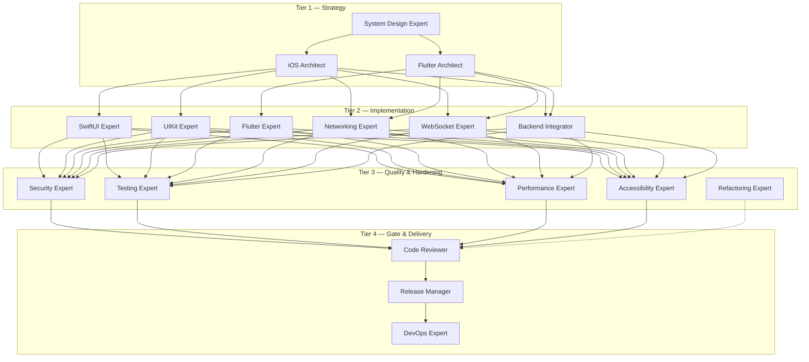
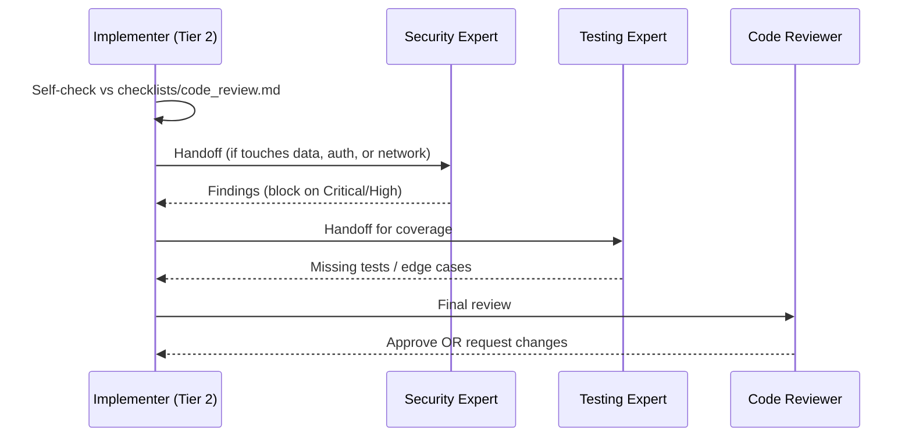
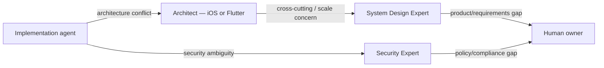

# AGENTS.md — Master Orchestration

This file defines how the agents in [`agents/`](agents/) collaborate. It is the
control plane of the toolkit: it describes the **agent hierarchy**, **task routing
rules**, **review flow**, **escalation flow**, and **multi-agent workflows**.

AI platforms that auto-load `AGENTS.md` (e.g. Codex) read this first. Other platforms
should load it alongside `README.md` when coordinating multi-step work.

---

## Operating Principles (apply to every agent)

1. **Architecture first.** Default to Clean Architecture (Domain / Data / Presentation)
   with the presentation pattern that matches the UI framework — MVVM for SwiftUI, MVP for UIKit,
   Riverpod `Notifier` + immutable state for Flutter. Respect SOLID.
2. **Security is a requirement, not a feature.** Follow [`standards/security_standards.md`](standards/security_standards.md)
   and OWASP MASVS. Never log secrets; never store tokens in plaintext.
3. **Make it testable.** Inject dependencies through protocols. No hidden singletons in
   business logic.
4. **Be explicit about errors and concurrency.** Use typed errors and Swift Concurrency
   (`async/await`, actors) deliberately. On legacy targets, bridge existing promise and
   completion-handler APIs at the data boundary rather than rewriting call sites. On Flutter, the
   equivalent is Dart `async`/`await` with `Future`/`Stream`, sealed failure types, and isolates
   for CPU-bound work — never a bare `catch (_)`.
5. **Stay consistent.** Conform to [`standards/`](standards/). Generated code should look
   like one team wrote it.
6. **Self-review before handoff.** Every agent ends its turn by checking its work against
   the matching file in [`checklists/`](checklists/).

---

## Platform & Paradigm Scoping

This toolkit supports multiple platforms and UI paradigms. **Detect the platform and paradigm first, then load only that platform/paradigm's subtree plus the shared layers** — this keeps context lean and prevents loading another platform's code.

**Detect platform from the project:**

| Signal | Platform |
|--------|----------|
| `Package.swift`, `*.xcodeproj`, `*.xcworkspace` | `ios` |
| `build.gradle`, `settings.gradle`, `gradlew` | `android` |
| `pubspec.yaml` | `flutter` |
| `package.json` with a `react-native` dependency | `react_native` |

When the signal is ambiguous or absent, **ask**; default to `ios`.

The `ui:` axis below applies **only to `ios`**. Flutter has a single UI paradigm: Riverpod
`Notifier` + immutable state is the toolkit's default presentation pattern (see
[`standards/flutter_standards.md`](standards/flutter_standards.md)). If a Flutter codebase is
already on BLoC/Cubit, follow the existing pattern — read
[`skills/architecture/flutter/state_management.md`](skills/architecture/flutter/state_management.md)
§"When to Choose BLoC/Cubit Instead" — and never mix the two libraries in one codebase. Flutter
files never carry `ui:`.

**Detect UI paradigm (for iOS):**

| Signal | Paradigm |
|--------|----------|
| `@main struct …: App` | `swiftui` |
| `AppDelegate` + `SceneDelegate`, no `App` struct | `uikit` |
| `UIViewController` subclasses dominate the UI tree | `uikit` |
| Both present, plus `UIHostingController` | `mixed` |

- **New projects default to `swiftui`.** With no existing UI tree to inspect, the paradigm is a choice rather than a discovery, and SwiftUI remains the toolkit's primary focus. UIKit is chosen for greenfield work only when the user asks.
- **Existing codebases with conflicting signals: ask.** Never guess at a codebase's architecture silently.
- **Mixed resolves to a dominant and a secondary paradigm.** Dominant holds the majority of the UI tree. Existing code is read and modified under the dominant paradigm's rules. New screens may use the secondary, but only via `workflows/migrate_uikit_to_swiftui.md` — never ad hoc.
- **Loading rule.** Load files where `platform:` matches and (`ui:` is absent or matches the detected paradigm). In mixed mode, load both.

Platform-specific files declare `platform:` and optional `ui:` (e.g. `platform: ios`, `ui: uikit`) in front-matter for precise filtering. Omitting `ui:` means the file applies to both paradigms. **A file with no `platform:` key at all is shared and always loads** — that is how `architecture/`, `workflows/`, and the platform-neutral files in `standards/` and `checklists/` are scoped.

**What is platform-scoped vs shared:**

- **Platform-scoped** (load only the detected platform/paradigm): `skills/<topic>/<platform>/…`,
  `templates/<platform>/…`. Each platform-specific file also declares `platform:` and optional `ui:` in its
  front-matter for precise filtering.
- **Shared** (always in scope, never forked per platform): [`standards/`](standards/) (contains platform/paradigm specific standards filtered by front-matter rules),
  [`architecture/`](architecture/), [`checklists/`](checklists/), [`workflows/`](workflows/),
  and the agents in [`agents/`](agents/) (selected by name, e.g. `swiftui_expert` or `uikit_expert` for iOS, `flutter_expert` for Flutter).

**Coverage today.** iOS is complete. Flutter ships a **foundation pack** — architecture, state
management, navigation, DI, repository, platform channels, networking, storage, security, testing,
and rendering performance — plus its own standards, review checklist, and templates. Flutter has no
notifications, GraphQL, SSE, file-upload, JWT, biometric, or crypto skill yet. Android and React
Native are early.

If the detected platform has no file for a needed topic, **say so** and fall back to the shared
concept docs in [`architecture/`](architecture/) and [`standards/`](standards/) rather than silently
translating the iOS file.

---

## Agent Hierarchy

Agents are organized into four tiers. Higher tiers set constraints that lower tiers must
respect.


```mermaid
graph TD
    subgraph Tier1[Tier 1 — Strategy]
        SD[System Design Expert]
        ARCH[iOS Architect]
        FARCH[Flutter Architect]
    end
    subgraph Tier2[Tier 2 — Implementation]
        UI[SwiftUI Expert]
        UIK[UIKit Expert]
        FL[Flutter Expert]
        NET[Networking Expert]
        WS[WebSocket Expert]
        BE[Backend Integrator]
    end
    subgraph Tier3[Tier 3 — Quality & Hardening]
        SEC[Security Expert]
        TEST[Testing Expert]
        PERF[Performance Expert]
        A11Y[Accessibility Expert]
        REF[Refactoring Expert]
    end
    subgraph Tier4[Tier 4 — Gate & Delivery]
        REV[Code Reviewer]
        REL[Release Manager]
        OPS[DevOps Expert]
    end

    SD --> ARCH & FARCH
    ARCH --> UI & UIK & NET & WS & BE
    FARCH --> FL & NET & WS & BE
    UI & UIK & FL & NET & WS & BE --> SEC & TEST & PERF & A11Y
    SEC & TEST & PERF & A11Y --> REV
    REF -.-> REV
    REV --> REL
    REL --> OPS
```

| Tier | Role | Agents |
|------|------|--------|
| 1 | Decide *what* and *how it is shaped* | System Design Expert, iOS Architect, Flutter Architect |
| 2 | Build it | SwiftUI, UIKit, Flutter, Networking, WebSocket, Backend Integrator |
| 3 | Harden and prove it | Security, Testing, Performance, Accessibility, Refactoring |
| 4 | Gate and ship it | Code Reviewer, Release Manager, DevOps |

---

## Task Routing Rules

Route the request to the **entry agent** based on intent, then follow the chain.

Two entry-agent cells below are **platform slots**, resolved from the platform (and, on iOS, the
paradigm) detected in [Platform & Paradigm Scoping](#platform--paradigm-scoping):

| Slot | `ios` | `flutter` |
|------|-------|-----------|
| `Architect` | [iOS Architect](agents/ios_architect.md) | [Flutter Architect](agents/flutter_architect.md) |
| `UI Expert` | [SwiftUI Expert](agents/swiftui_expert.md) (`ui: swiftui`) · [UIKit Expert](agents/uikit_expert.md) (`ui: uikit`) | [Flutter Expert](agents/flutter_expert.md) |

`android` and `react_native` have no architect or UI expert yet. Fall back to the
[System Design Expert](agents/system_design_expert.md) and say the platform role is missing, rather
than answering with iOS or Flutter guidance.

| Request type | Entry agent | Typical chain |
|--------------|-------------|---------------|
| New feature | `Architect` | Architect → UI/Net → Security → Testing → Reviewer |
| New screen / UI change (SwiftUI) | SwiftUI Expert | SwiftUI → Accessibility → Testing → Reviewer |
| New screen / UI change (UIKit) | UIKit Expert | UIKit → Accessibility → Testing → Reviewer |
| New screen / UI change (Flutter) | Flutter Expert | Flutter → Accessibility → Testing → Reviewer |
| State management refactor *(Flutter)* | Flutter Architect | Architect → Flutter → Testing → Reviewer |
| Native interop / platform channel *(Flutter)* | Flutter Architect | Architect → Flutter → Security → Testing → Reviewer |
| Massive view controller / legacy cleanup *(iOS)* | Refactoring Expert | Refactoring → UIKit → Testing → Reviewer |
| UIKit → SwiftUI migration *(iOS)* | iOS Architect | Architect → UIKit → SwiftUI → Testing → Reviewer |
| New/changed API integration | Backend Integrator | Backend → Networking → Security → Testing → Reviewer |
| Realtime feature | WebSocket Expert | Architect → WebSocket → Security → Testing → Reviewer |
| Auth / login / tokens | Security Expert | Architect → Security → Networking → Testing → Reviewer |
| Code review / PR review / `/review` | Code Reviewer | Scope resolution → automated linting → multi-pass analysis → verdict |
| Bug report | Code Reviewer | Reviewer (triage) → relevant specialist → Testing |
| "It's slow / janky" | Performance Expert | Performance → relevant specialist → Testing |
| Cleanup / tech debt | Refactoring Expert | Refactoring → Testing → Reviewer |
| Architecture question | System Design / `Architect` | (advisory, may not produce code) |
| Release / store submission | Release Manager | Release → DevOps |
| CI/CD / automation | DevOps Expert | DevOps → Reviewer |
| `!verify` | (workflow) | Run [`workflows/verify_setup.md`](workflows/verify_setup.md) |

The UI row is selected by the platform and — on iOS — the paradigm detected in Platform & Paradigm
Scoping, not by user preference.

**Claude Code:** each role has a matching native subagent in `.claude/agents/` (kebab-case,
e.g. `swiftui-expert`). Prefer dispatching those subagents over inline role-play — dispatched
agents appear as distinct named lanes in observability dashboards (see the "Visualizing agent
activity" section in [`README.md`](README.md)). Other platforms keep reading the plain
markdown roles in [`agents/`](agents/) as before.

**Routing heuristic for an orchestrator:** classify the request by *primary deliverable*
(architecture decision, UI, data, security, test, release). Pick the agent that owns that
deliverable as the entry point; everything else becomes a downstream review step.

**Scale process depth to scope.** Match the chain length to the task — don't run every gate
for every change:

- *Trivial / quick change* (bug, UI tweak, small edit) → go straight to the owning specialist,
  then a single Code Reviewer pass. Skip the Tier 1 strategy agents.
- *Substantial work* (new feature, new/changed API, architecture) → run the full chain above.

The agent makes this call itself by reading the request — it is **not** a mode the user has to
pick. A user can always override in plain language ("keep it quick" / "do a full review").

---

## Review Flow

Every change passes through layered review before it is considered done.


```mermaid
sequenceDiagram
    participant Impl as Implementer (Tier 2)
    participant Sec as Security Expert
    participant Test as Testing Expert
    participant Rev as Code Reviewer
    Impl->>Impl: Self-check vs checklists/code_review.md
    Impl->>Sec: Handoff (if touches data, auth, or network)
    Sec-->>Impl: Findings (block on Critical/High)
    Impl->>Test: Handoff for coverage
    Test-->>Impl: Missing tests / edge cases
    Impl->>Rev: Final review
    Rev-->>Impl: Approve OR request changes
```

**Gating rule:** a Critical or High finding from any reviewer **blocks** progression.
Medium/Low findings are recorded and may be deferred with an explicit note.

---

## Escalation Flow

When an agent hits a decision outside its scope or a conflict it cannot resolve, it
escalates **up the hierarchy** rather than guessing.


```mermaid
graph LR
    Impl[Implementation agent] -->|architecture conflict| ARCH[Architect — iOS or Flutter]
    ARCH -->|cross-cutting / scale concern| SD[System Design Expert]
    Impl -->|security ambiguity| SEC[Security Expert]
    SD -->|product/requirements gap| Human[Human owner]
    SEC -->|policy/compliance gap| Human
```

Escalate (do not assume) when:

- The required behavior is ambiguous or contradicts a standard.
- A security/compliance decision has legal or data-privacy implications.
- A change would break a public module boundary or API contract.
- Two agents' recommendations conflict and both cite valid standards.

The escalation output must state: the decision needed, the options, the trade-offs, and
the agent's recommendation.

---

## Multi-Agent Workflows

These map directly to files in [`workflows/`](workflows/).

`Architect` and `UI Expert` are the platform slots from [Task Routing Rules](#task-routing-rules) —
on iOS they resolve to **iOS Architect** and **SwiftUI Expert** or **UIKit Expert**; on Flutter, to
**Flutter Architect** and **Flutter Expert**.

### 1. Build a Feature

```text
Architect → UI Expert → Networking Expert → Security Expert → Testing Expert → Code Reviewer
```

See [`workflows/create_feature.md`](workflows/create_feature.md).

### 2. Integrate an API

```text
Backend Integrator → Networking Expert → Security Expert → Testing Expert → Code Reviewer
```

See [`workflows/integrate_rest_api.md`](workflows/integrate_rest_api.md).

### 3. Add Realtime

```text
Architect → WebSocket Expert → Security Expert → Performance Expert → Testing Expert → Code Reviewer
```

See [`workflows/integrate_websocket.md`](workflows/integrate_websocket.md).

### 4. Implement Authentication

```text
Architect → Security Expert → Networking Expert → Testing Expert → Code Reviewer
```

See [`workflows/implement_authentication.md`](workflows/implement_authentication.md).

### 5. Ship a Release

```text
Code Reviewer → Release Manager → DevOps Expert
```

See [`workflows/release_application.md`](workflows/release_application.md).

---

## Handoff Contract

When one agent hands off to another, it passes a compact, explicit context block:

```text
HANDOFF
- From: <agent>           To: <agent>
- Goal: <one sentence>
- Done so far: <bullets>
- Files touched: <paths>
- Decisions/assumptions: <bullets>
- Open questions / risks: <bullets>
- What the next agent must verify: <bullets>
```

This keeps multi-agent chains deterministic and reviewable.
