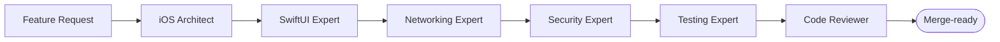

<div align="center">

# 📱 Mobile Engineering Agents

## Turn your AI coding agent into a Senior/Staff mobile engineer

A drop-in knowledge system that gives **Claude Code, Codex, Cursor, Windsurf, Gemini CLI, and Aider**
the judgment of an experienced mobile team — architecture, security, testing, and standards — so the
code they generate is production-grade, not just plausible.

[](LICENSE)
[](CONTRIBUTING.md)
[](#-whats-inside)
[](#-how-to-use)

[Quick Start](#-quick-start) · [What's Inside](#-whats-inside) · [The Agent Team](#-the-agent-team) · [How to Use](#-how-to-use) · [Workflows](#-example-workflows)

</div>

---

## 💡 Why this exists

AI agents can write a lot of mobile code, fast. The bottleneck isn't typing — it's **engineering
judgment**: picking the right architecture, getting concurrency and error handling right, securing
data, and keeping the codebase maintainable as it grows.

> **Without this toolkit:** "Build me a login screen" → a Massive View Controller with the token in
> `UserDefaults` and no tests.
>
> **With it:** the agent acts as a Security Expert + SwiftUI Expert — OAuth2 + PKCE, Keychain
> storage, MVVM, typed errors, and unit tests — then self-reviews against a checklist.

This repo encodes that judgment as machine-loadable **agents, skills, workflows, checklists,
templates, prompts, standards, and architecture references**. Primary focus: **iOS / Swift /
SwiftUI**; secondary: **Android/Kotlin** and **Flutter**.

It is **not** a tutorial or handbook. It's an operational toolkit you point your AI agent at.

---

## ⚡ Quick Start

```bash
# 1. Clone it next to (or inside) your project
git clone https://github.com/sokpichdev/mobile-engineering-agents.git
```

Then just talk to your AI agent and reference the files:

```text
> Read agents/ios_architect.md and act as that agent.
> Follow workflows/create_feature.md to build an Account Summary screen
  that loads /accounts, then self-review against checklists/code_review.md.
```

That's it. Editors like **Cursor**, **Windsurf**, **Claude Code**, and **Gemini CLI** auto-load the
matching config file (`.cursorrules`, `.windsurfrules`, `CLAUDE.md`, `GEMINI.md`) so the defaults
apply with zero setup. Jump to [How to Use](#-how-to-use) for per-tool examples.

---

## 📦 What's Inside

| Directory | What it gives your agent | Count |
|-----------|--------------------------|-------|
| 🤖 [`agents/`](agents/) | Loadable expert roles (architect, security, testing…) | 14 |
| 🧠 [`skills/`](skills/) | Deep, single-topic know-how (auth, websockets, caching…) | 31 |
| 🔄 [`workflows/`](workflows/) | Step-by-step procedures (build a feature, integrate an API…) | 11 |
| ✅ [`checklists/`](checklists/) | Objective, automatable review gates | 8 |
| 📐 [`standards/`](standards/) | Non-negotiable rules (coding, security, testing, git) | 7 |
| 🏛️ [`architecture/`](architecture/) | Reference designs with Mermaid diagrams | 6 |
| ✍️ [`prompts/`](prompts/) | Copy-paste prompts for common tasks | 10 |
| 🧩 [`templates/`](templates/) | Scaffolding with boilerplate Swift | 8 |
| 📲 [`examples/`](examples/) | Reference apps (banking, chat, ecommerce, social) | 4 |

Plus [`AGENTS.md`](AGENTS.md) (orchestration), [`GLOSSARY.md`](GLOSSARY.md) (shared terms), and a
`README.md` index inside every directory.

---

## 🤖 The Agent Team

Each agent is a self-contained role: **purpose, responsibilities, hard rules, coding standards,
review checklist, common mistakes, and example tasks**. They're organized into four tiers that hand
off to each other (see [`AGENTS.md`](AGENTS.md)).

### 🧭 Strategy

- [System Design Expert](agents/system_design_expert.md) — large-scale client/server & cross-cutting design
- [iOS Architect](agents/ios_architect.md) — module boundaries, layering, tech decisions

### 🛠️ Implementation

- [SwiftUI Expert](agents/swiftui_expert.md) — view composition, state, navigation
- [Networking Expert](agents/networking_expert.md) — REST/GraphQL clients, retries, error mapping
- [WebSocket Expert](agents/websocket_expert.md) — realtime transport, reconnection, backpressure
- [Backend Integrator](agents/backend_integrator.md) — API contracts, DTO mapping, pagination

### 🛡️ Quality & Hardening

- [Security Expert](agents/security_expert.md) — Keychain, pinning, crypto, OWASP MASVS
- [Testing Expert](agents/testing_expert.md) — unit/integration/UI strategy
- [Performance Expert](agents/performance_expert.md) — startup, memory, battery, rendering
- [Accessibility Expert](agents/accessibility_expert.md) — VoiceOver, Dynamic Type, contrast
- [Refactoring Expert](agents/refactoring_expert.md) — safe, incremental improvement

### 🚦 Gate & Delivery

- [Code Reviewer](agents/code_reviewer.md) — correctness, style, risk gating
- [Release Manager](agents/release_manager.md) — versioning, signing, store submission
- [DevOps Expert](agents/devops_expert.md) — CI/CD, Fastlane, automation

---

## 🚀 How to Use

The pattern is the same everywhere: **load the relevant agent/skill/workflow file into context, then
ask for the task.**

<details>
<summary><b>Claude Code</b></summary>

`CLAUDE.md` loads automatically. Pull in a specific role or workflow:

```text
> Read agents/security_expert.md and act as that agent.
> Audit Sources/Auth for credential issues using checklists/security_review.md.
> Follow workflows/integrate_rest_api.md to add the /transactions endpoint.
```

</details>

<details>
<summary><b>OpenAI Codex</b></summary>

`AGENTS.md` is read automatically. Reference files in your prompt:

```text
Using agents/swiftui_expert.md and standards/swiftui_standards.md, build the
account summary screen described below.
```

</details>

<details>
<summary><b>Cursor</b></summary>

`.cursorrules` applies automatically. Add a file to context and prompt:

```text
@workflows/integrate_graphql.md implement the feed query with pagination.
```

</details>

<details>
<summary><b>Windsurf</b></summary>

`.windsurfrules` is applied by Cascade. Reference files in chat:

```text
@checklists/code_review.md review the open diff.
```

</details>

<details>
<summary><b>Gemini CLI</b></summary>

`GEMINI.md` loads automatically. Use `@path` to include files:

```text
@agents/testing_expert.md @standards/testing_standards.md write tests for AuthRepository.
```

</details>

<details>
<summary><b>Aider</b></summary>

Add files to the chat session:

```bash
aider --read agents/ios_architect.md --read standards/architecture_standards.md
```

</details>

---

## 🔄 Example Workflows

Ready-made, end-to-end procedures — each with inputs, steps, validation, and acceptance criteria:

- 🏗️ **Build a feature end-to-end** — [`workflows/create_feature.md`](workflows/create_feature.md)
- 🌐 **Integrate a REST API** — [`workflows/integrate_rest_api.md`](workflows/integrate_rest_api.md)
- ⚡ **Add realtime with WebSockets** — [`workflows/integrate_websocket.md`](workflows/integrate_websocket.md)
- 🔐 **Implement authentication** — [`workflows/implement_authentication.md`](workflows/implement_authentication.md)
- 🛡️ **Run a security audit** — [`workflows/perform_security_audit.md`](workflows/perform_security_audit.md)
- 🚢 **Ship a release** — [`workflows/release_application.md`](workflows/release_application.md)

Behind the scenes, a non-trivial task flows through multiple agents:



---

## ✅ Best Practices

1. **Load the smallest sufficient context** — the specific agent/skill/workflow, not the whole repo.
2. **Chain agents** for real work: architect → implementer → reviewer.
3. **Always end with a checklist** — have the agent self-review against [`checklists/`](checklists/).
4. **Treat standards as non-negotiable** — reference [`standards/`](standards/) for consistent output.
5. **Prefer workflows over ad-hoc prompts** for anything you'll do more than once.

---

## 🧭 Design Principles

Every agent defaults to the same engineering values, so output looks like one team wrote it:

- **Clean Architecture + MVVM** and **SOLID** by default.
- **Security is a requirement, not an afterthought** (OWASP MASVS).
- **Testable, modular, observable** code with explicit, typed error handling.
- **Consistent standards** across sessions, tools, and contributors.

---

## 🤝 Contributing

Contributions are welcome! See [CONTRIBUTING.md](CONTRIBUTING.md). In short: keep files focused,
follow the section templates, cross-link instead of duplicating, and use illustrative (not
necessarily compilable) Swift that demonstrates the correct pattern.

---

## 🗺️ Roadmap

- [ ] Kotlin/Compose and Flutter parity for the iOS-first skills.
- [ ] Machine-readable agent manifests (YAML front-matter) for automated routing.
- [ ] Expanded example apps with full test suites.
- [ ] Evaluations that score agent output against the checklists.
- [ ] Optional MCP server exposing skills as callable tools.

---

## 📄 License

[MIT](LICENSE) © Sok Pich — free to use, fork, and adapt.

<div align="center">

**If this makes your AI a better mobile engineer, give it a ⭐ and share it.**

</div>
