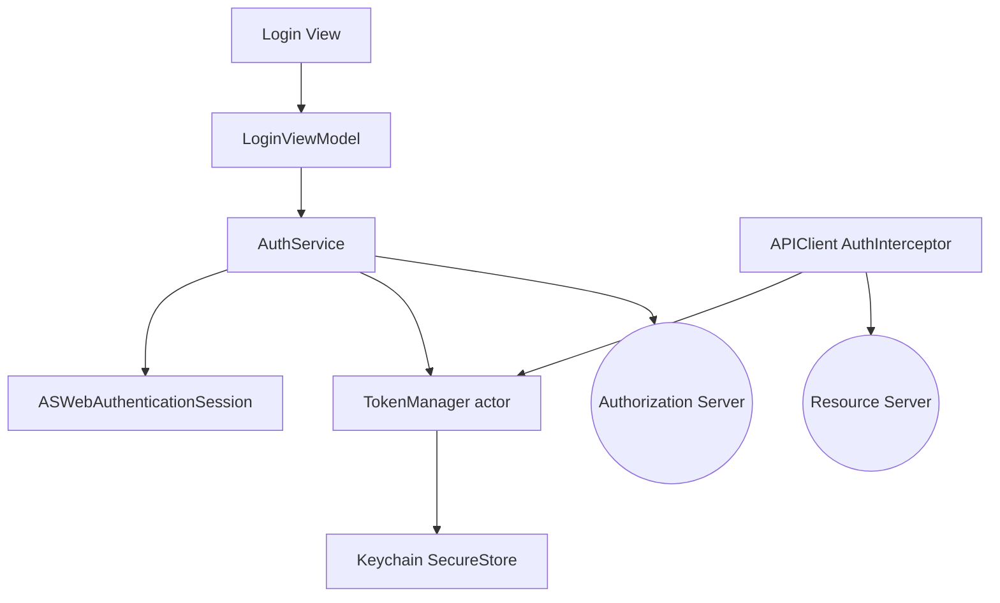
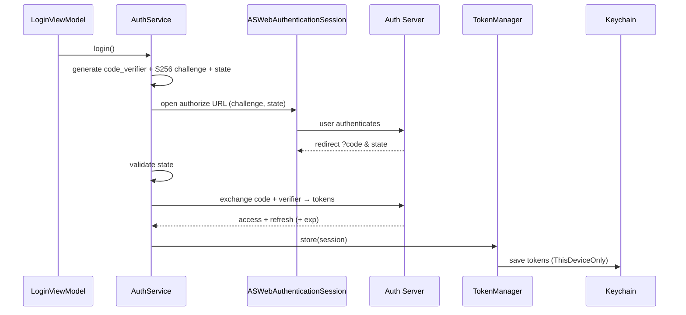
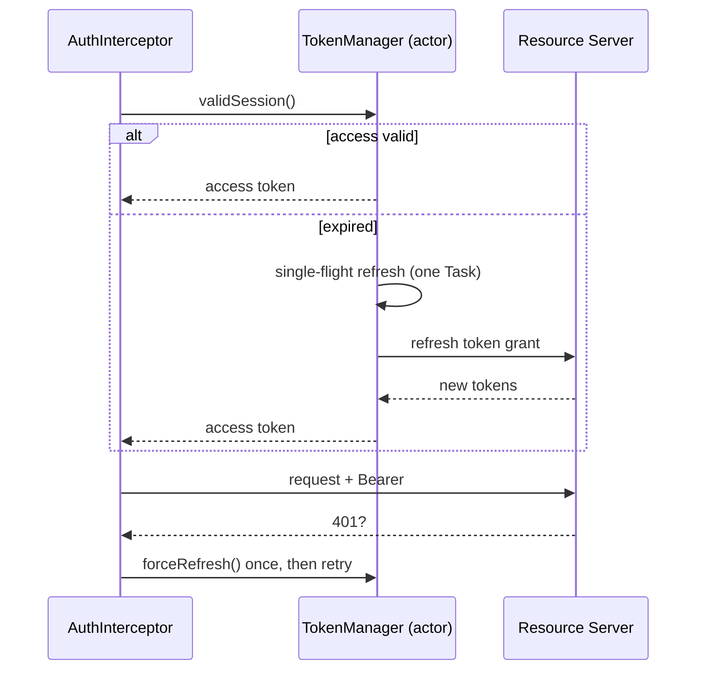

# Architecture: Authentication Architecture

Structure for secure auth: OAuth2 + PKCE, Keychain storage, single-flight refresh, and
authorized networking. See [`skills/security/oauth2.md`](../skills/security/oauth2.md) and
[`workflows/implement_authentication.md`](../workflows/implement_authentication.md).

## Overview

`TokenManager` (an actor) is the single owner of session tokens; both the login flow and the
networking interceptor go through it, which is what makes refresh race-free.

## Login Flow (Authorization Code + PKCE)

## Authorized Request + Single-Flight Refresh

## Components

- **AuthService** — runs the PKCE login flow via `ASWebAuthenticationSession`.
- **TokenManager (actor)** — owns tokens; `validSession()` returns a fresh access token,
  serializing refresh so concurrent callers share one refresh.
- **Keychain SecureStore** — persists tokens (`...ThisDeviceOnly`), optionally biometric-gated.
- **AuthInterceptor** — injects the bearer header; handles 401 with one forced refresh + retry.
- **Logout** — clears Keychain + caches; resets session state.

## Security Invariants

- Authorization Code + PKCE only; no implicit flow / embedded secret; `state` validated.
- Tokens in Keychain only; never logged; cleared on logout.
- Exactly one in-flight refresh; JWT `exp` enforced with skew.

## Related

- [networking_architecture.md](networking_architecture.md)
- [`templates/authentication_layer/`](../templates/authentication_layer/)
- [`checklists/security_review.md`](../checklists/security_review.md)
