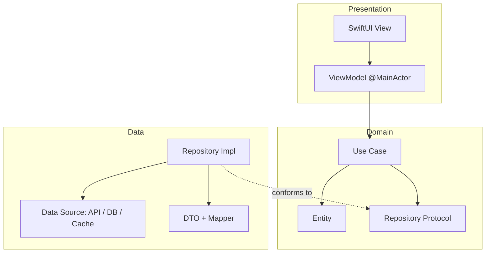
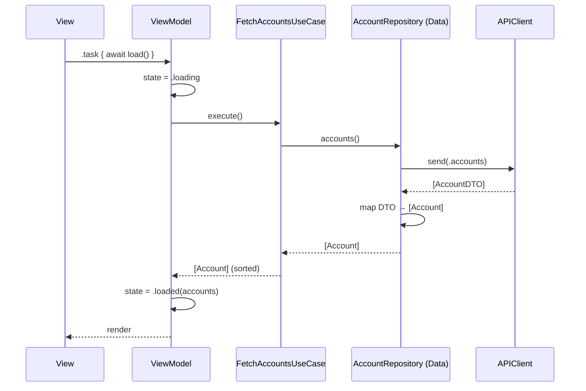

# Architecture: Clean Architecture

How the toolkit applies Clean Architecture to iOS. The companion skill is
[`skills/architecture/clean_architecture.md`](../skills/architecture/clean_architecture.md);
the rules are in [`standards/architecture_standards.md`](../standards/architecture_standards.md).

## Overview

Three layers with dependencies pointing **inward**. Inner layers know nothing about outer
ones; outer layers depend on inner abstractions (Dependency Inversion).



The dependency arrows only point toward Domain. `RepositoryImpl` (Data) conforms to the
`RepositoryProtocol` (Domain) — the only link from Data into Domain, and it's via abstraction.

## Data Flow (read path)



## Dependency Rule (enforced)

- Domain: pure Swift, **no** framework imports.
- Data depends on Domain (implements its protocols); never the reverse.
- Presentation depends on Domain (use cases); never on Data directly.
- DTOs stay in Data.

## Sample Implementation

```swift
// Domain
struct Account: Equatable { let id: String; let name: String; let balanceCents: Int }
protocol AccountRepository { func accounts() async throws -> [Account] }
struct FetchAccountsUseCase {
    let repository: AccountRepository
    func execute() async throws -> [Account] {
        try await repository.accounts().sorted { $0.balanceCents > $1.balanceCents }
    }
}

// Data
struct AccountDTO: Decodable { let id: String; let name: String; let balance_cents: Int }
final class RemoteAccountRepository: AccountRepository {
    let client: APIClient
    init(client: APIClient) { self.client = client }
    func accounts() async throws -> [Account] {
        try await client.send(Endpoint<[AccountDTO]>(path: "/accounts"))
            .map { Account(id: $0.id, name: $0.name, balanceCents: $0.balance_cents) }
    }
}

// Presentation (see skills/architecture/mvvm.md for the full ViewModel)
```

## Composition Root

```swift
enum AppContainer {
    static func makeAccountsViewModel() -> AccountsViewModel {
        let client = LiveAPIClient(baseURL: .api)
        let repo = RemoteAccountRepository(client: client)
        return AccountsViewModel(fetchAccounts: FetchAccountsUseCase(repository: repo))
    }
}
```

## When to simplify

For a tiny app, collapsing use cases into the repository is acceptable — but keep the
**layer boundaries and the dependency rule**. Add use cases when business logic grows.

## Related

- [feature_module_architecture.md](feature_module_architecture.md)
- [`skills/architecture/repository_pattern.md`](../skills/architecture/repository_pattern.md)
- [`templates/clean_architecture_feature/`](../templates/clean_architecture_feature/)
