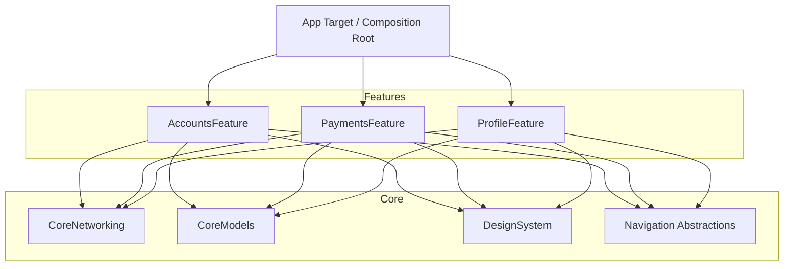
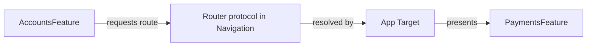

# Architecture: Feature Module Architecture

How features are structured as self-contained, layered modules. See
[`skills/architecture/modularization.md`](../skills/architecture/modularization.md).

## Overview

Each feature is a vertical slice (Domain + Data + Presentation) packaged as a Swift Package.
Features depend on shared **Core** modules, never on each other directly. Cross-feature
navigation goes through abstractions.



No `Feature → Feature` edges. The App target is the only place that knows about all features
(it wires them at the composition root).

## Internal Module Layout

```text
AccountsFeature/
├── Sources/AccountsFeature/
│   ├── Domain/        Account.swift, FetchAccountsUseCase.swift, AccountRepository.swift
│   ├── Data/          AccountDTO.swift, AccountMapper.swift, RemoteAccountRepository.swift
│   ├── Presentation/  AccountsViewModel.swift, AccountsView.swift
│   └── AccountsFeature.swift   // public entry: factory + public View
└── Tests/AccountsFeatureTests/
```

## Public Interface

Keep the surface minimal — expose a factory and the root view; everything else is `internal`.

```swift
public enum AccountsFeature {
    public static func makeRootView(client: APIClient) -> some View {
        let repo = RemoteAccountRepository(client: client)
        let vm = AccountsViewModel(fetchAccounts: FetchAccountsUseCase(repository: repo))
        return AccountsView(viewModel: vm)
    }
}
```

## Cross-Feature Communication



A feature emits a typed route to a `Router` protocol (defined in a shared Navigation module);
the App target resolves it and presents the target feature. Features stay decoupled.

## Build & Test Benefits

- Incremental, parallel builds; changing one feature doesn't recompile others.
- The compiler enforces boundaries (can't import what isn't a dependency).
- Each feature owns its tests and can be developed in isolation with stubbed Core.

## Rules

- Dependency graph is a **DAG** pointing toward Core.
- No `Feature → Feature` imports.
- Public API minimal; default `internal`.
- Avoid a catch-all "Common" module — keep Core modules cohesive.

## Related

- [clean_architecture.md](clean_architecture.md)
- [`templates/feature_module/`](../templates/feature_module/)
