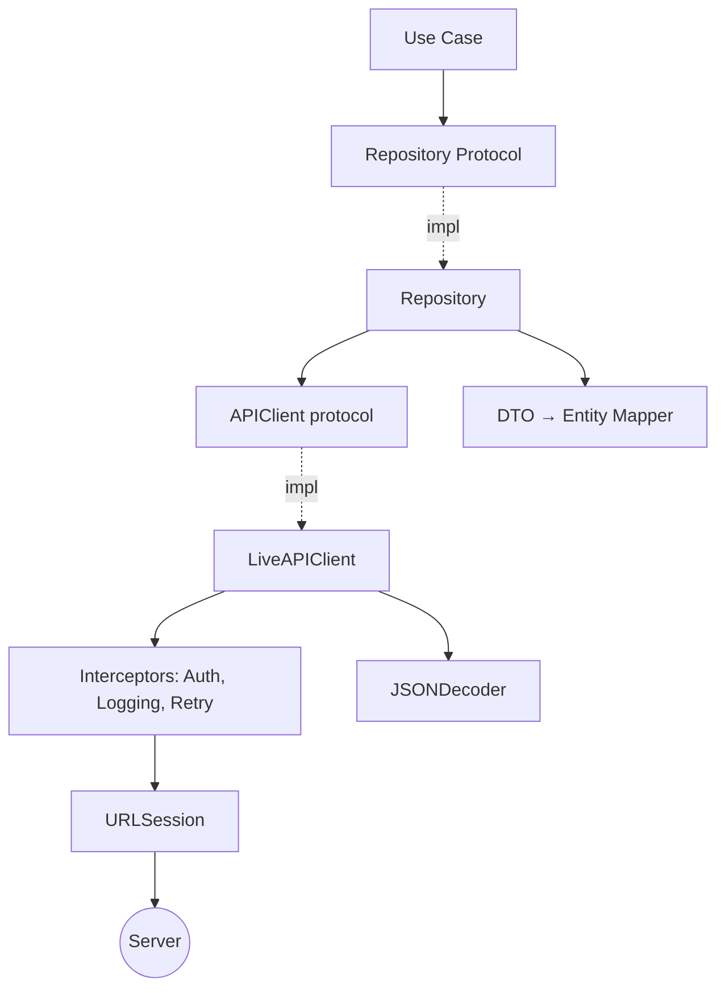
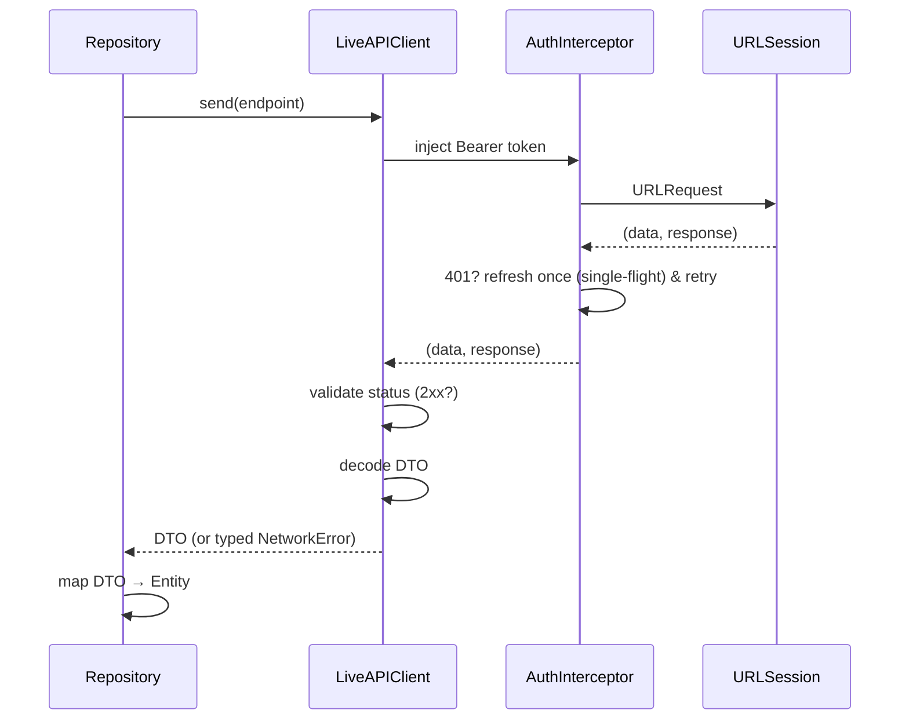
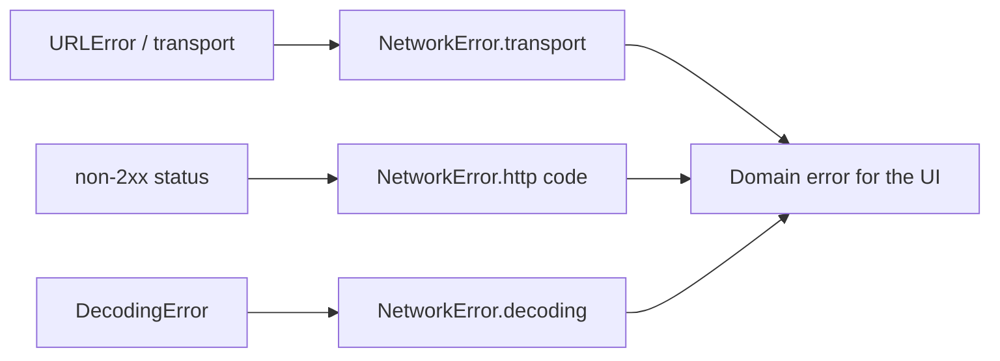

# Architecture: Networking Architecture

The structure of the network/data layer. See
[`skills/networking/rest_api.md`](../skills/networking/rest_api.md) and
[`standards/networking_standards.md`](../standards/networking_standards.md).

## Overview

Features depend on **repository protocols**. Repositories use an injectable `APIClient` that
wraps `URLSession`, validates responses, decodes DTOs, and maps errors. Cross-cutting
concerns (auth, logging, retries) are composed as interceptors/middleware.



## Request Lifecycle



## Error Mapping



The UI only ever sees domain errors with user-meaningful messages — never `URLError` or raw
status codes.

## Sample Composition

```swift
protocol APIClient { func send<R: Decodable>(_ e: Endpoint<R>) async throws -> R }

final class LiveAPIClient: APIClient {
    private let session: URLSession
    private let baseURL: URL
    private let decoder: JSONDecoder
    private let auth: AuthInterceptor

    func send<R: Decodable>(_ endpoint: Endpoint<R>) async throws -> R {
        let request = try auth.authorize(endpoint.urlRequest(base: baseURL))
        let (data, response) = try await auth.performWithRefresh(request, using: session)
        guard let http = response as? HTTPURLResponse else { throw NetworkError.invalidResponse }
        guard (200..<300).contains(http.statusCode) else { throw NetworkError.http(http.statusCode) }
        do { return try decoder.decode(R.self, from: data) } catch { throw NetworkError.decoding }
    }
}
```

## Design Notes

- **Single decoder** configured once (snake_case + ISO8601).
- **Auth** is single-flight: concurrent 401s trigger one refresh.
- **Retries** only on idempotent requests with backoff + jitter.
- **Testability:** features depend on `APIClient`/repository protocols → stub in tests.

## Related

- [authentication_architecture.md](authentication_architecture.md)
- [`templates/networking_layer/`](../templates/networking_layer/)
- [`checklists/api_review.md`](../checklists/api_review.md)
