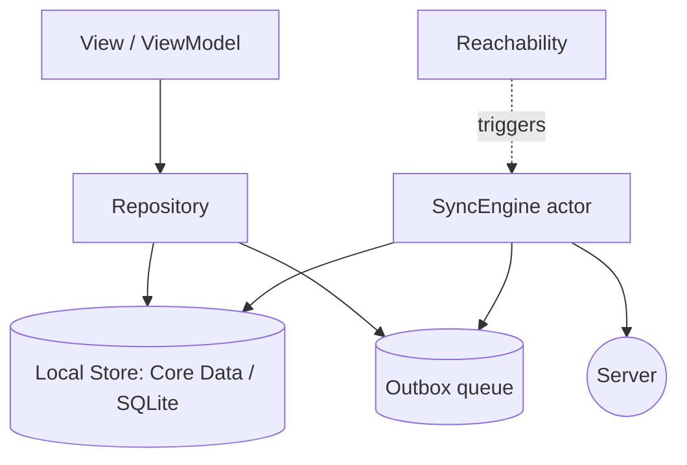
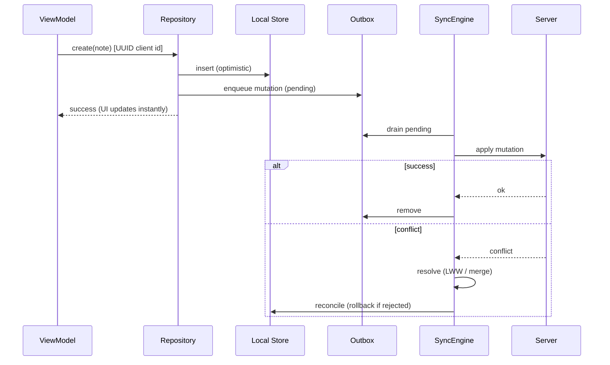
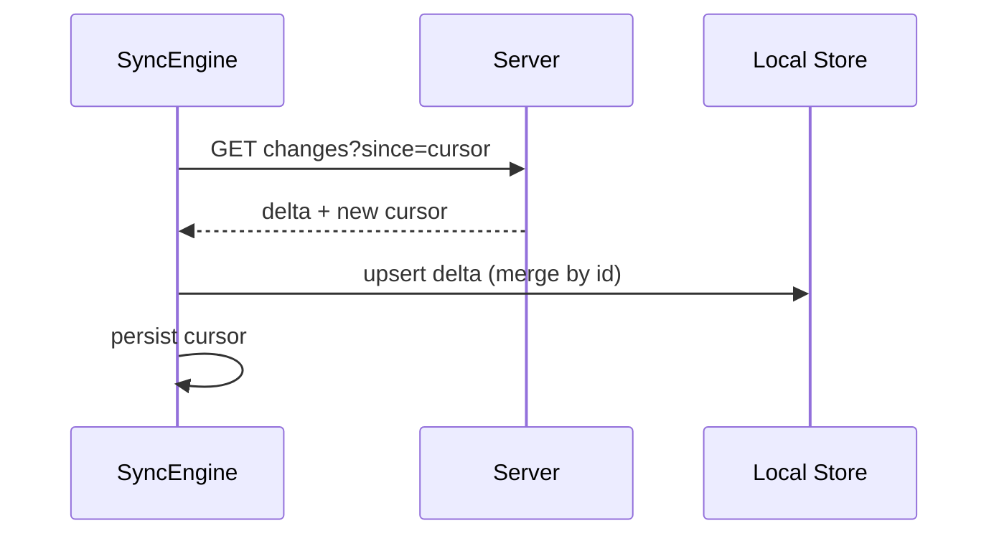

# Architecture: Offline-First Architecture

Structure for apps where the **local store is the source of truth** and the network syncs in
the background. See [`skills/storage/offline_sync.md`](../skills/storage/offline_sync.md) and the
[System Design Expert](../agents/system_design_expert.md).

## Overview

The UI reads and writes the local store. Mutations are queued in an **outbox** and synced
when connectivity allows; remote changes are pulled as deltas and merged with a defined
conflict policy.



## Write Path (optimistic)



## Read / Pull Sync



## Building Blocks

- **Local store as source of truth** — UI never blocks on the network.
- **Outbox** — pending mutations with status (`pending/syncing/failed`) + backoff retry.
- **Optimistic updates + rollback** — apply locally; reconcile/rollback on server response.
- **Conflict policy** — explicit: last-write-wins (server timestamps), field-merge, or CRDTs.
- **Stable client ids (UUID)** — offline-created records reconcile cleanly.
- **Delta sync via cursor/`updatedAt`** — fetch only what changed.

## State Per Record

```swift
enum SyncStatus: String { case pending, syncing, synced, failed }
struct Note: Identifiable { let id: UUID; var text: String; var syncStatus: SyncStatus }
```

The UI can surface `pending`/`failed` (e.g. a small "not synced" indicator).

## Trade-offs

- Strong UX and resilience, at the cost of conflict-handling complexity.
- Choose the simplest conflict strategy that fits the data; reserve CRDTs for true
  collaborative editing.

## Related

- [`skills/storage/caching.md`](../skills/storage/caching.md)
- [`skills/storage/coredata.md`](../skills/storage/coredata.md)
- [`agents/system_design_expert.md`](../agents/system_design_expert.md)
