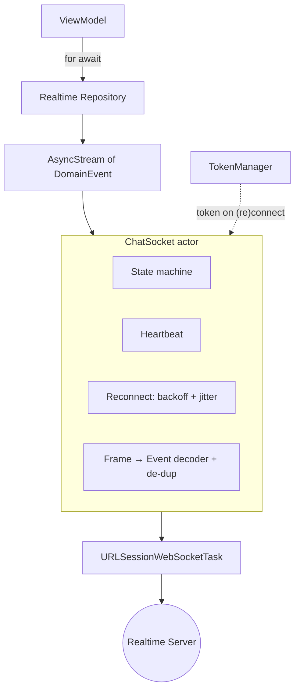
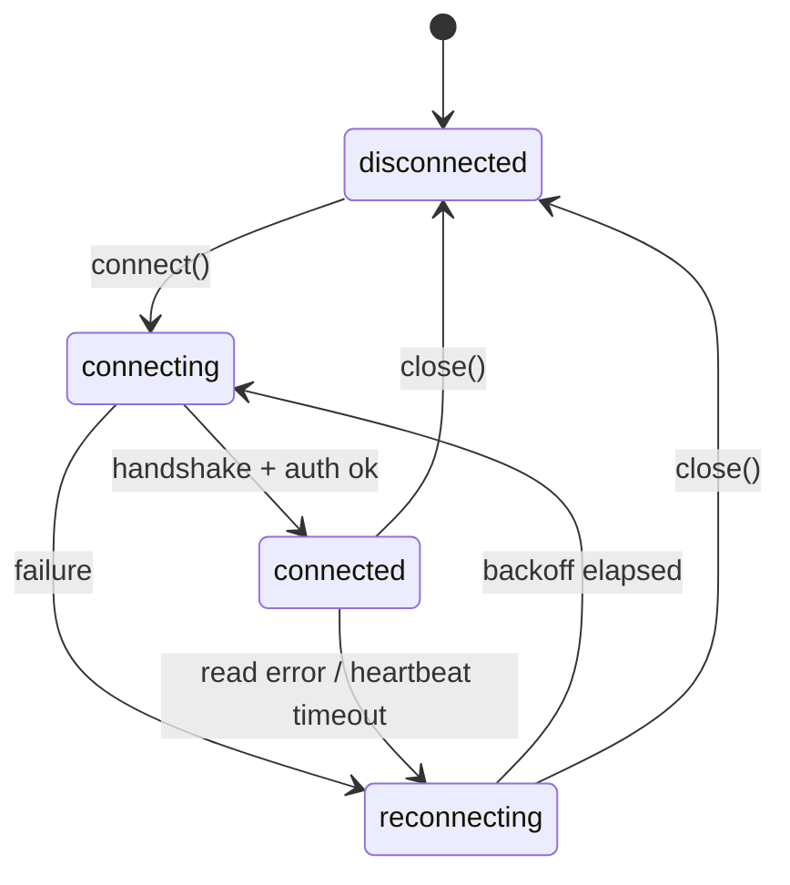
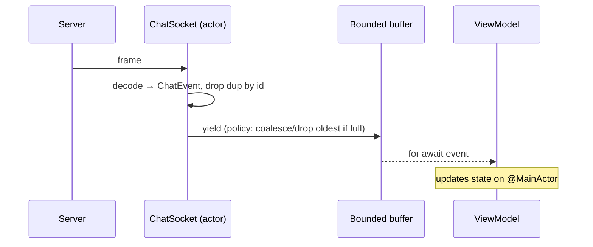

# Architecture: WebSocket / Realtime Architecture

Structure for reliable realtime features. See
[`skills/networking/ios/websocket.md`](../skills/networking/ios/websocket.md) and the
[WebSocket Expert](../agents/websocket_expert.md).

## Overview

An actor-isolated transport manages the socket lifecycle and exposes typed domain events as an
`AsyncStream`. A repository adapts the stream for features; the ViewModel consumes events and
reflects connection state in the UI.



## Connection State Machine



## Message Flow with Backpressure



## Reliability Building Blocks

- **State machine** — no ad-hoc booleans; every transition explicit.
- **Heartbeat + read timeout** — detect dead connections proactively.
- **Backoff + jitter reconnection** — capped; never a hot loop.
- **Re-auth on (re)connect** — refresh expired tokens first.
- **De-duplication by id** — at-least-once delivery assumed.
- **Bounded buffer** — explicit overflow policy (drop oldest / coalesce / suspend).

## UI State Contract

```swift
enum RealtimeState { case connecting, connected, reconnecting, disconnected }
```

The header/status view renders this so users understand degraded connectivity.

## Sample (abridged)

```swift
actor ChatSocket {
    private(set) var state: ConnectionState = .disconnected
    let events: AsyncStream<ChatEvent>
    // connect() authenticates, starts heartbeat, runs receiveLoop(),
    // scheduleReconnect() uses min(pow(2, attempt), 30) + jitter.
    // Full implementation in skills/networking/ios/websocket.md
}
```

## Related

- [`checklists/websocket_review.md`](../checklists/websocket_review.md)
- [`templates/ios/websocket_layer/`](../templates/ios/websocket_layer/)
- [`workflows/integrate_websocket.md`](../workflows/integrate_websocket.md)
