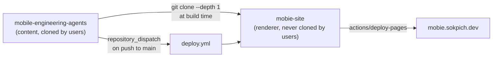

# Design: Documentation Site and Landing Page

- **Date:** 2026-08-23
- **Status:** Approved, pending implementation plan
- **Scope:** Publish a landing page and full documentation site for the toolkit at
  `mobie.sokpich.dev`, built from the toolkit's existing markdown, without adding any
  website code to the toolkit repository.

---

## 1. Problem

The toolkit has no published web presence, but it already advertises one. `README.md`
carries both a docs badge and a nav link pointing at
`https://sokpichdev.github.io/mobile-engineering-agents/`, which returns 404. Every visitor
who follows either link hits a dead end.

Meanwhile the repository already contains a documentation site's worth of source material:

| Measure | Value |
|---------|-------|
| Markdown files (excluding `node_modules`) | 173 |
| Total markdown content | ~634 KB |
| Files containing Mermaid diagrams | 13 |
| Directories with a `README.md` index | 9 |

The content exists and is well organized. What is missing is a renderer, a navigable
structure, search, and a page that explains the toolkit to someone who has never seen it.

### The distribution constraint

The toolkit is consumed by cloning it into a user's project as `.mobile-agents/`:

```bash
git clone https://github.com/sokpichdev/mobile-engineering-agents.git .mobile-agents
```

Every file in the repository therefore lands inside every user's project. A static site
generator's config, dependencies, theme components, and landing page are dead weight in
that context — they are never loaded by an agent and never read by the user.

This constraint is the design's primary driver: **the toolkit repository must remain
agent-focused content only.**

---

## 2. Goals and non-goals

### Goals

1. A designed landing page that converts a first-time visitor into a user.
2. All 173 markdown files rendered as a navigable, searchable documentation site.
3. Single source of truth — the site renders the toolkit's files, never copies of them.
4. Zero website code in the toolkit repository.
5. Docs go live within minutes of a merge to the toolkit's `main`.

### Non-goals

- Versioned documentation. There are no releases yet; add it when there are.
- Internationalization.
- Hand-authored documentation pages that duplicate or reword toolkit files.
- Migrating toolkit content into a website-specific format.
- Auto-generating the `README.md` inventory counts. Tracked separately.

---

## 3. Decisions

| Decision | Choice | Rationale |
|----------|--------|-----------|
| Site scope | Landing page **and** full docs | The README badge implies both |
| Content model | Single source of truth, fetched at build | The files *are* the product; drift is a correctness bug |
| Repository | Separate repo, `mobie-site` | Toolkit stays agent-only |
| Host | GitHub Pages, custom domain `mobie.sokpich.dev` | Subdomain avoids colliding with the apex |
| Generator | VitePress | See §4 |
| Rebuild trigger | `repository_dispatch` from the toolkit on push to `main` | Docs never lag reality |
| Landing structure | Before/after hero, then the 4-tier agent map | Proof first, differentiation second |
| Visual direction | Technical Editorial (light default), Terminal Dark (dark mode) | The product is engineering judgment; editorial styling says so |

### 3.1 Why VitePress

The toolkit's markdown is dense with relative inter-file links — `[AGENTS.md](AGENTS.md)`,
`[standards/security_standards.md](standards/security_standards.md)`, and a `README.md`
index inside every directory that links to its siblings.

VitePress resolves `.md` links to routes natively, and its route structure mirrors the
source file structure. Setting `srcDir` to the fetched toolkit therefore makes every one of
those links work **without rewriting any of them**. The same file is correct when read on
GitHub, when loaded by an agent, and when rendered on the site.

The alternatives were rejected on this specific point:

- **Astro Starlight** produces a better-looking site with more landing-page freedom, but it
  does not auto-resolve arbitrary relative `.md` links. It would need a custom rehype
  plugin to rewrite repo-relative links to routes — permanent infrastructure whose failure
  mode is silently 404'ing links inside `skills/`.
- **Docusaurus** is the most mature, but is the heaviest build, and pointing `docs.path` at
  a parent directory pulls the whole tree and requires aggressive exclusion patterns. It
  would be the right choice if versioned docs or i18n were goals. They are not.

VitePress also supplies local search (MiniSearch, no external account), dark mode, and
Mermaid support via a single plugin.

---

## 4. Architecture

### 4.1 Repository boundary

Two repositories with a strict, one-directional relationship: the site reads the toolkit;
the toolkit never reads the site.



**Invariant:** if a markdown file other than the landing page is ever committed to
`mobie-site`, this design has been violated. The site repository contains a renderer, not
content.

### 4.2 Site repository layout

```text
mobie-site/
  .vitepress/
    config.ts              nav, mermaid, local search, srcExclude, srcDir
    sidebar.gen.ts         walks the toolkit tree, emits the sidebar
    theme/
      index.ts             extends the VitePress default theme
      editorial.css        light palette, serif display, hairline rules
      terminal-dark.css    dark palette
      Landing.vue          hero, tier map, install, inventory, tools
      PlatformBadge.vue    renders platform:/ui: front-matter as a badge
  site/
    index.md               landing page (frontmatter: layout: home)
    public/CNAME           mobie.sokpich.dev
  scripts/
    fetch-toolkit.sh       shallow clone into .content/toolkit
    assemble.sh            copy site/* into .content/toolkit
  .github/workflows/deploy.yml
  .content/                gitignored, never committed
  package.json
```

### 4.3 Build pipeline

VitePress distinguishes `root` (where `.vitepress/` lives) from `srcDir` (where markdown
lives). This design sets `root` to the site repository and `srcDir` to the fetched toolkit.

1. **Fetch.** `fetch-toolkit.sh` runs
   `git clone --depth 1 https://github.com/sokpichdev/mobile-engineering-agents .content/toolkit`.
   Shallow, because history is irrelevant to rendering.
2. **Assemble.** `assemble.sh` copies `site/index.md` and `site/public/` into
   `.content/toolkit/`. This is the only write into the fetched tree, and it adds the
   landing page — which is site content, not toolkit content.
3. **Generate the sidebar.** `sidebar.gen.ts` walks `.content/toolkit`, treating each
   directory's `README.md` as the section index and each file's first H1 as its label.
4. **Build.** VitePress renders to `dist/`. Routes mirror source paths:
   `agents/security_expert.md` becomes `/agents/security_expert`.

The sidebar is generated rather than hand-written. A hand-maintained sidebar of 173 entries
would drift from the repository within a month, reintroducing exactly the divergence this
design exists to prevent.

**`srcExclude`:** `node_modules/**`, `docs/superpowers/**`, `.github/**`, `.superpowers/**`,
`path/**`, `CODEOWNERS`.

### 4.4 Two properties that fall out for free

**Front-matter becomes a UI feature.** Platform-scoped files already declare their scope:

```yaml
---
platform: ios
ui: uikit
---
```

VitePress parses this as page front-matter, so `PlatformBadge.vue` can render an
"iOS · UIKit" badge on every scoped page at zero authoring cost. The metadata already
exists and is already maintained.

**Directory links resolve.** Links of the form `[agents/](agents/)` work because VitePress
treats `README.md` as a directory index, and every toolkit directory already has one.

This second property is an assumption, not a verified fact. It is the first item the
implementation plan must verify. **Fallback if it does not hold:** `assemble.sh` creates a
`index.md` symlink beside each directory's `README.md`.

### 4.5 Deployment

`mobie-site/.github/workflows/deploy.yml` triggers on:

- `push` to `main` (site changes)
- `repository_dispatch` with type `toolkit-updated` (toolkit changes)
- `workflow_dispatch` (manual)
- `schedule`, weekly (backstop against a lapsed dispatch token — see §8)

Steps: checkout site, setup Node, `fetch-toolkit.sh`, `assemble.sh`, build, then
`actions/upload-pages-artifact` and `actions/deploy-pages`.

`mobile-engineering-agents/.github/workflows/notify-site.yml` triggers on push to `main`
and fires a `repository_dispatch` at `mobie-site`.

**Credential.** The dispatch requires a fine-grained personal access token scoped to
`mobie-site` with `metadata: read` and `contents: write` (the REST API requires write access
to create a repository dispatch event), stored in the toolkit repository as
the secret `SITE_DISPATCH_TOKEN`. This is the only credential in the design.

**DNS.** A `CNAME` record for `mobie` pointing at `sokpichdev.github.io`, plus the `CNAME`
file in `site/public/`.

---

## 5. Landing page

Sections, in order:

1. **Hero — the before/after.** The headline, subhead, and the two-column code contrast
   from `README.md`: `UserDefaults` and a Massive View Controller on the left; Keychain,
   MVVM, typed errors and tests on the right. This is above the fold because it is the
   strongest asset the project has, and it demonstrates rather than claims.
2. **The four-tier agent map.** Strategy, Implementation, Quality & Hardening, Gate &
   Delivery, with handoff arrows. Each tier links into `/agents/`. This is what
   distinguishes the toolkit from a prompt pack, and it is real — it is rendered from the
   same hierarchy `AGENTS.md` defines.
3. **Three-step install**, with a copy button on each command.
4. **What's inside** — the inventory table, each row linking to its section.
5. **Supported tools** — Claude Code, Codex, Cursor, Windsurf, Gemini CLI, Aider.

### 5.1 Visual direction

One theme, two palettes, both extending the VitePress default theme.

| Token | Light (default) | Dark |
|-------|-----------------|------|
| Ground | `#faf8f4` | `#0b0d12` |
| Text | `#1a1814` | `#e6e8ef` |
| Muted text | `#5c574e` | `#8b93a7` |
| Accent | `#c2410c` | `#7c5cff` |
| Positive | `#15803d` | `#3ddc84` |
| Negative | `#b91c1c` | `#ff6b6b` |
| Display type | Georgia / serif | Georgia / serif |
| Body type | system sans | system sans |
| Code | system mono | system mono |

Light is warm paper with a serif display face, numbered section eyebrows, and hairline
rules — a published engineering handbook rather than a product page. Dark inverts to
near-black with a violet accent, matching the toolkit's existing badge colour.

---

## 6. Changes to the toolkit repository

Exactly three, none of which is website code:

| File | Change |
|------|--------|
| `README.md` | Docs badge and nav link retargeted to `https://mobie.sokpich.dev` |
| `.github/workflows/notify-site.yml` | New. ~15 lines. Fires `repository_dispatch` on push to `main` |
| `.gitignore` | Add `.superpowers/` |

Separately noted, out of scope for this design: `path/to/skills/notifications/{ios,android}/fcm.py`
appears to be an artifact of a command run with a literal `path/to` placeholder. It is
excluded via `srcExclude`, but should be deleted from the repository.

---

## 7. Testing and correctness

Because the site is a rendering of the repository rather than a transformation of it, the
test surface is "does the rendering faithfully match the source?"

| Check | Where | Catches |
|-------|-------|---------|
| Build succeeds with zero VitePress warnings | site CI | Broken front-matter, unresolvable imports |
| `lychee` over built `dist/` | site CI | Links that pass markdownlint but break under routing |
| Rendered page count matches eligible file count | site CI | A bad `srcExclude` silently dropping a directory |
| Mermaid blocks render in all 13 files | site CI | Plugin regressions |
| `markdownlint-cli2` + `markdown-link-check` | toolkit CI (existing, unchanged) | Source-level markdown problems |

The page-count assertion is the important one. Without it, an over-broad exclusion pattern
would drop an entire section of the docs and the build would still pass green.

---

## 8. Risks

| Risk | Mitigation |
|------|------------|
| VitePress does not treat `README.md` as a directory index | Verified as plan step 1; fallback is per-directory `index.md` symlinks in `assemble.sh` |
| `SITE_DISPATCH_TOKEN` expires, docs silently stop updating | Add a weekly `schedule` trigger to `deploy.yml` as a backstop |
| Toolkit front-matter keys collide with VitePress reserved keys | Only `platform:` and `ui:` are used; neither is reserved. Guard with the page-count assertion |
| Generated sidebar produces poor ordering for 173 files | Section order is the order directories appear in the root `README.md` inventory table; within a section, order follows the link order parsed from that directory's `README.md`, falling back to alphabetical when no links are found |
| Site repo accumulates content over time, defeating the design | CI check in `mobie-site` failing on any committed `.md` outside `site/` |

---

## 9. Open items for the implementation plan

1. Verify VitePress `README.md`-as-index behaviour before building anything on it.
2. Confirm `mobie-site` as the repository name.
3. Create the fine-grained PAT and DNS record — both require account access and cannot be
   automated.
