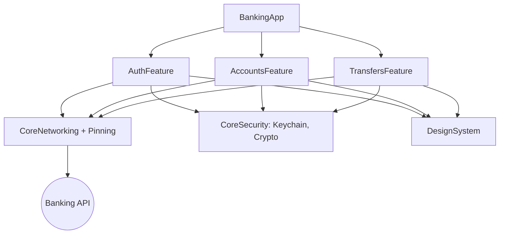

# Example: Banking App

A reference architecture for a **security-first** banking app. Demonstrates how the toolkit's
agents, skills, and standards combine on a high-sensitivity product.

## What it demonstrates

- Clean Architecture + MVVM across Accounts, Transfers, and Auth features.
- OAuth2 + PKCE auth with Keychain storage and biometric app-lock.
- TLS public-key pinning for the banking API.
- REST integration with idempotent transfers and typed error mapping.
- High unit-test coverage of money-handling logic.

## Module Map



## Clean Architecture (Transfers slice)

- **Domain:** `Money`, `Account`, `TransferUseCase` (validates funds, currency), `TransferRepository`.
- **Data:** `TransferDTO`, mapper, `RemoteTransferRepository` with an **idempotency key** per transfer.
- **Presentation:** `TransferViewModel` (state enum), `TransferView`.

```swift
struct TransferUseCase {
    let repository: TransferRepository
    func execute(amount: Money, from: Account, to accountID: String) async throws -> Receipt {
        guard amount.cents > 0 else { throw TransferError.invalidAmount }
        guard from.balance >= amount else { throw TransferError.insufficientFunds }
        return try await repository.transfer(amount: amount, from: from.id,
                                             to: accountID, idempotencyKey: UUID().uuidString)
    }
}
```

## Authentication

- Authorization Code + PKCE via `ASWebAuthenticationSession`
  ([`skills/security/ios/oauth2.md`](../../skills/security/ios/oauth2.md)).
- Tokens in Keychain (`...ThisDeviceOnly`), refresh via a single-flight `TokenManager` actor.
- Biometric app-lock gates the dashboard ([`skills/security/ios/biometric_auth.md`](../../skills/security/ios/biometric_auth.md)).

## Security

- Public-key pinning on the banking host with a backup pin
  ([`skills/security/ios/ssl_pinning.md`](../../skills/security/ios/ssl_pinning.md)).
- No secrets/PII in logs; sensitive fields excluded from screenshots/backups.
- Audited against [`checklists/security_review.md`](../../checklists/security_review.md).

## Dependency Injection

- `BankingAppContainer` composition root wires clients → repositories → use cases → ViewModels.
- Features expose `make…View(client:tokenManager:)` factories.

## Error Handling

- `NetworkError` → `TransferError`/`DomainError`; the UI shows actionable messages
  ("Insufficient funds", "Try again").
- Transfers are idempotent so a retried request never double-charges.

## Testing Strategy

- Unit: money math, `TransferUseCase` (funds/limits/currency), refresh races.
- Integration: DTO decode + error mapping via `URLProtocol` stubs and fixtures.
- UI: login → dashboard → transfer happy path only.

## Scalability Considerations

- Feature modules build/test independently; new products (Cards, Loans) added as modules.
- Pagination for transaction history ([`skills/networking/ios/pagination.md`](../../skills/networking/ios/pagination.md)).
- Caching of account summaries with short TTL; invalidation after transfers.

## Build it with the toolkit

[`workflows/implement_authentication.md`](../../workflows/implement_authentication.md) →
[`workflows/integrate_rest_api.md`](../../workflows/integrate_rest_api.md) →
[`workflows/perform_security_audit.md`](../../workflows/perform_security_audit.md).
