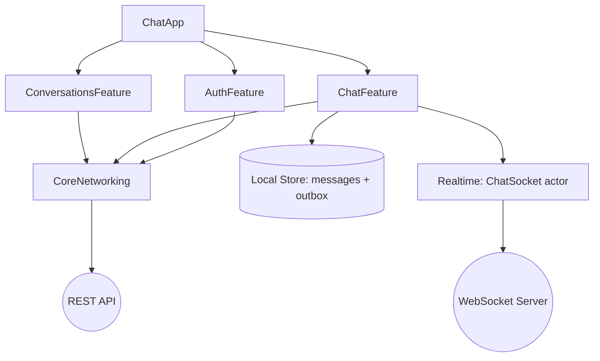

# Example: Chat App

A reference architecture for a **realtime, offline-capable** messaging app. Demonstrates
WebSockets, optimistic sends, and sync.

## What it demonstrates

- WebSocket transport (actor + state machine + backoff) exposed as `AsyncStream`.
- Optimistic message sending with an outbox and delivery status.
- Offline-first local store as the source of truth.
- Clean Architecture + MVVM; push notifications with deep-link routing.

## Module Map



## Realtime

- `ChatSocket` actor: connect → authenticate → heartbeat → receive loop → capped backoff
  reconnection; de-dup by message id ([`skills/networking/ios/websocket.md`](../../skills/networking/ios/websocket.md)).
- UI reflects `connecting/connected/reconnecting` state in the chat header.

```swift
for await event in chatSocket.events {     // typed domain events
    switch event {
    case .message(let id, let text): await store.upsertIncoming(id: id, text: text)
    case .presence(let userID, let online): await store.setPresence(userID, online)
    }
}
```

## Offline + Optimistic Send

- The message list reads from the **local store**, not the socket directly.
- Sending inserts a `pending` message immediately; the outbox syncs via REST/socket; status
  moves `pending → sent → delivered` (or `failed` with retry).
- See [`skills/storage/ios/offline_sync.md`](../../skills/storage/ios/offline_sync.md) and
  [`architecture/offline_first_architecture.md`](../../architecture/offline_first_architecture.md).

## Authentication

- OAuth2 + PKCE; the socket re-authenticates on every reconnect using the `TokenManager`.

## Dependency Injection

- Composition root wires `ChatSocket`, repositories, and the local store into ViewModels.
- `ChatSocket` takes a `tokenProvider` closure so it stays decoupled from auth internals.

## Error Handling

- Connection drops surface as UI state, not crashes; failed sends are retryable.
- Decode failures on a frame are logged and skipped, never fatal.

## Testing Strategy

- Unit: outbox state machine, optimistic-send/rollback, de-dup logic.
- Integration: frame decoding; reconnection behavior with a fake socket.
- UI: send-and-receive happy path on a stubbed transport.

## Scalability Considerations

- Message pagination (load older on scroll) with stable ids.
- Backpressure: coalesce presence/typing events; bound the inbound buffer.
- Per-conversation lazy loading; images downsampled.

## Build it with the toolkit

[`workflows/integrate_websocket.md`](../../workflows/integrate_websocket.md) →
[`workflows/add_push_notifications.md`](../../workflows/add_push_notifications.md).
