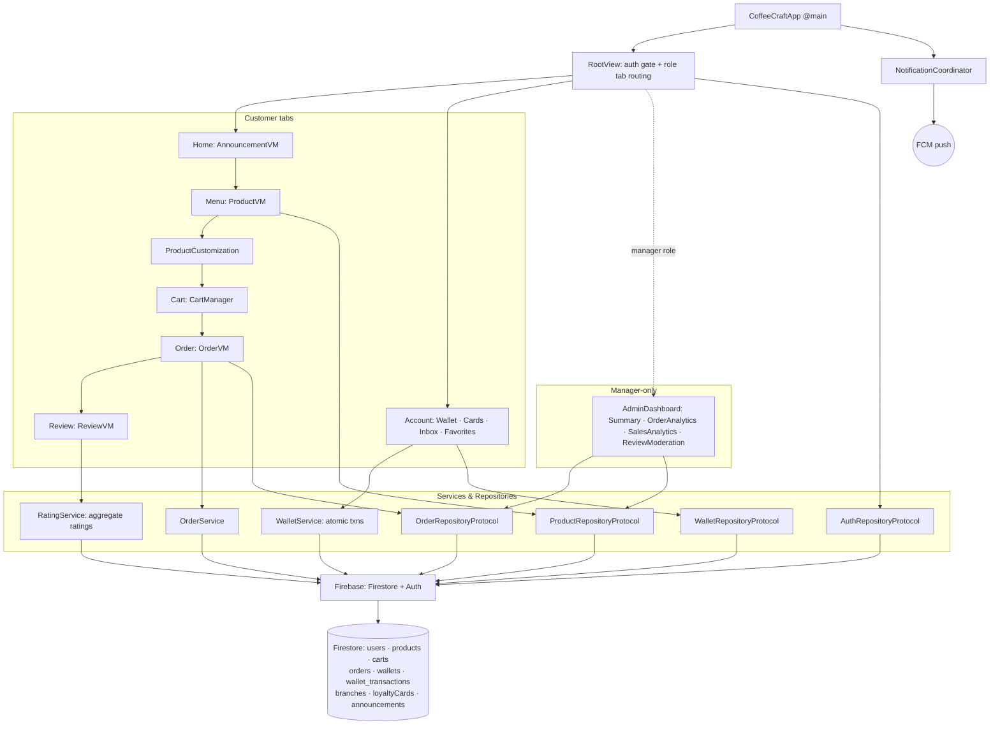

# Example: CoffeeCraft (Coffee Shop Ordering)

A production iOS app for coffee-shop ordering with **two roles (Customer / Manager)**, real-time
order tracking, an atomic in-app wallet, proof-of-purchase reviews, and a manager analytics
dashboard. Built with **SwiftUI + Firebase**. It shows how the toolkit's principles —
protocol-injected data sources, real-time sync, atomic money mutations, role-based UI — apply on a
**Firebase/Firestore** backend rather than a hand-rolled REST stack.

> Real app by the repo author. Source: [github.com/cobra-PICH/CoffeeCraft](https://github.com/cobra-PICH/CoffeeCraft).

## What it demonstrates

- **MVVM + Repository** with strict dependency inversion — ViewModels depend only on repository
  protocols (`AuthRepositoryProtocol`, `OrderRepositoryProtocol`, `WalletRepositoryProtocol`,
  `ProductRepositoryProtocol`) and never import Firebase directly, so they swap to fakes in tests.
- **Real-time Firestore** via snapshot listeners for products, wallet, and inbox; **cursor-based
  pagination** for orders.
- **Atomic money mutations** — top-up, payment, and refund all run through `db.runTransaction()`
  so the `wallets` balance and the append-only `wallet_transactions` ledger stay consistent.
- **Proof-of-purchase reviews** — a rating is only allowed after a completed order containing that
  product; rating aggregates are updated transactionally.
- **Role-based experience** — one app, two surfaces; the tab bar and Menu controls are filtered by
  `UserRole` (`.customer` / `.manager`).
- **Push + deep-link routing** — FCM tokens stored per device; a tap routes through a coordinator
  to the Orders tab.
- **Multi-environment** Firebase config (Dev / SIT / UAT / Prod schemes).

## Module Map



## Dependency Injection

- Global state (`UserSession`, `AuthViewModel`, `OrderViewModel`, `WalletViewModel`,
  `ThemeManager`, `NotificationCoordinator`) is injected at the root via `@EnvironmentObject`;
  scene-scoped objects (`CartManager`, `ProductViewModel`, …) are created in `RootView`.
- Every Firebase-backed domain has a **protocol + a Firestore implementation**; ViewModels take the
  repository via initializer injection defaulting to the Firebase impl — the seam the
  [`testing_expert`](../../agents/testing_expert.md) relies on.
- Aligns with [`architecture/feature_module_architecture.md`](../../architecture/feature_module_architecture.md)
  and the toolkit's "inject through protocols" rule.

## Real-Time Data Strategy

| Strategy | Used for |
|----------|----------|
| Snapshot listeners | Products, wallet balance, wallet transactions, inbox |
| Cursor-based pagination | Orders (page size 5; listener covers all loaded pages) |
| `db.runTransaction()` | Wallet top-up, order payment, cancellation refund |

The order list reads from the local listener state, so status moves
`Pending → Preparing → Ready → Completed` update live without a manual refresh — the same
local-store-as-source-of-truth idea as [`skills/storage/offline_sync.md`](../../skills/storage/offline_sync.md).

## Wallet: Atomic Money Mutations

- All balance changes flow through `WalletService.shared` inside a Firestore transaction, writing
  both the `wallets/{userId}` balance **and** a `wallet_transactions` ledger row with
  `balanceBefore` / `balanceAfter` snapshots for auditability.
- Cancelling a `Pending` order issues an automatic refund of `walletAmountPaid` in the same
  transactional pattern — money is never created or lost on a partial failure.

```swift
// Conceptual: payment + ledger row committed atomically
try await db.runTransaction { txn, _ in
    let wallet = try txn.wallet(for: userID)           // read current balance
    guard wallet.balance >= amount else { throw WalletError.insufficientFunds }
    txn.setBalance(userID, wallet.balance - amount)     // debit
    txn.appendLedger(.payment(amount: -amount,
                              balanceBefore: wallet.balance,
                              balanceAfter: wallet.balance - amount,
                              referenceID: orderID))     // audit trail
    return nil
}
```

## Authentication

- Firebase Auth (email/password) with session restore on launch via `Auth.auth().currentUser`;
  identity and role live in `UserSession`. See [`architecture/authentication_architecture.md`](../../architecture/authentication_architecture.md)
  for how to layer this behind a protocol and keep secrets out of logs.

## Reviews (Proof of Purchase)

- Before rating, the app queries `orders` for a completed order containing the product id; star
  ratings are one-per-user at `products/{id}/ratings/{userId}`, and `RatingService` updates
  `avgRating` / `ratingCount` / `ratingDistribution` transactionally on submit.

## Error Handling

- Insufficient funds, failed payments, and connectivity loss surface as UI state
  (`AlertManager` / `ToastManager` / `OfflineBannerModifier`), never crashes.
- Decode/listener failures are logged via `AppLog` (structured logging, not `print`) and skipped.

## Testing Strategy

- **Unit:** wallet transaction math (debit/credit, refund), proof-of-purchase gate, cart
  total/option-delta computation — all against fake repositories.
- **Integration:** Firestore encode/decode for `CartItem`/`Order` snapshots; pagination cursor
  behavior with a stubbed data source.
- **UI:** place-order happy path and role-filtered tab visibility on a stubbed backend.
- See [`skills/testing/unit_testing.md`](../../skills/testing/unit_testing.md).

## Scalability Considerations

- Orders paginate (page size 5) with a listener spanning loaded pages; lists lazy-load.
- `AsyncImageCard` downsamples remote images with a shimmer skeleton while loading.
- Per-environment Firebase projects isolate dev/test data from production.

## Build it with the toolkit

[`workflows/implement_authentication.md`](../../workflows/implement_authentication.md) →
[`workflows/create_feature.md`](../../workflows/create_feature.md) (menu, cart, orders, wallet) →
[`workflows/add_push_notifications.md`](../../workflows/add_push_notifications.md) →
self-review against [`checklists/code_review.md`](../../checklists/code_review.md) and
[`checklists/security_review.md`](../../checklists/security_review.md).
