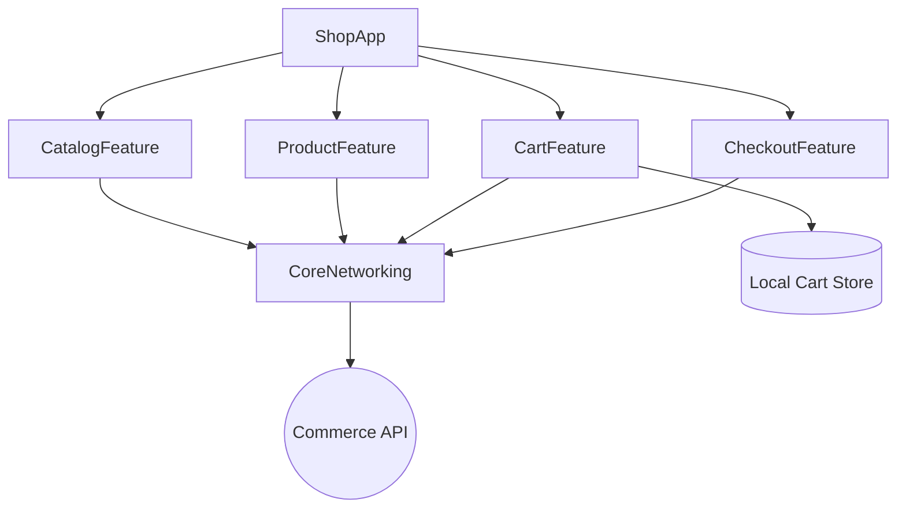

# Example: E-Commerce App

A reference architecture for a **catalog + cart + checkout** app. Demonstrates pagination,
caching, and a robust checkout flow.

## What it demonstrates

- Clean Architecture + MVVM across Catalog, Product, Cart, and Checkout features.
- Paginated, cached product catalog (cache-then-network / stale-while-revalidate).
- Idempotent checkout with typed error handling.
- GraphQL or REST data layer behind repositories.

## Module Map



## Catalog: Pagination + Caching

- Cursor pagination with de-dup and prefetch threshold
  ([`skills/networking/pagination.md`](../../skills/networking/pagination.md)).
- `CachingProductRepository` (actor) serves cached pages, revalidates in the background
  ([`skills/storage/caching.md`](../../skills/storage/caching.md)).

```swift
func products(after cursor: String?) async throws -> Page<Product> {
    if cursor == nil, let cached = await cache.firstPage() {
        Task { try? await refreshFirstPage() }      // stale-while-revalidate
        return cached
    }
    let page = try await remote.products(after: cursor)
    await cache.store(page)
    return page
}
```

## Cart & Checkout

- Cart persisted locally so it survives relaunch; merges with server cart on login.
- `CheckoutUseCase` validates the cart, then calls `PaymentRepository.charge` with an
  **idempotency key**; declines/timeouts map to actionable errors.

## Authentication

- Optional OAuth2 login (guest browsing allowed); checkout requires an authenticated session.

## Dependency Injection

- Composition root wires repositories (catalog/cart/payment) + caches into ViewModels.
- Feature factories accept the client + cart store.

## Error Handling

- Network/decoding → `DomainError`; out-of-stock and payment-declined are first-class cases.
- The cart never silently loses items on a failed sync.

## Testing Strategy

- Unit: pagination merge/de-dup, cart totals/discounts, checkout validation.
- Integration: catalog decode + cache behavior with fixtures.
- UI: browse → add to cart → checkout happy path.

## Scalability Considerations

- Catalog handles large datasets via pagination + image downsampling.
- Cache bounded with TTL; invalidated on price/stock changes.
- Features build independently; promotions/wishlist added as new modules.

## Build it with the toolkit

[`workflows/integrate_rest_api.md`](../../workflows/integrate_rest_api.md) (or
[`integrate_graphql.md`](../../workflows/integrate_graphql.md)) →
[`workflows/create_feature.md`](../../workflows/create_feature.md).
