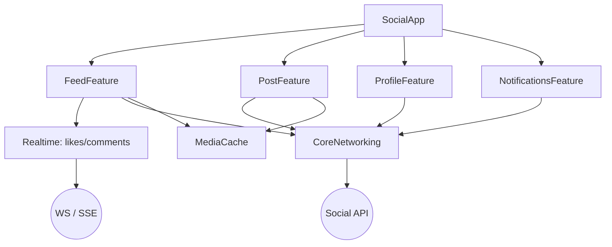

# Example: Social Media App

A reference architecture for a **feed-centric** social app. Demonstrates an infinite feed,
media handling, and realtime interactions at scale.

## What it demonstrates

- Clean Architecture + MVVM across Feed, Post, Profile, and Notifications features.
- Infinite-scroll feed with cursor pagination and prefetching.
- Efficient image/video handling (downsampling, bounded caches).
- Realtime likes/comments via WebSocket or SSE; push notifications with deep links.

## Module Map



## Feed: Pagination + Performance

- Cursor pagination, de-dup by post id, prefetch a few items before the end
  ([`skills/networking/ios/pagination.md`](../../skills/networking/ios/pagination.md)).
- `LazyVStack`/`List` with stable ids; images **downsampled** to cell size; bounded `MediaCache`
  ([`skills/performance/ios/memory_optimization.md`](../../skills/performance/ios/memory_optimization.md)).

```swift
.onAppear { Task { await viewModel.loadNextPageIfNeeded(currentItem: post) } }
```

## Realtime Interactions

- Live like/comment counts via SSE (server→client) or a WebSocket
  ([`skills/networking/ios/sse.md`](../../skills/networking/ios/sse.md));
  counts coalesce so a hot post doesn't flood the UI.

## Authentication

- OAuth2 + PKCE; the feed personalizes per session; tokens in Keychain.

## Dependency Injection

- Composition root wires feed/post/profile repositories, realtime streams, and `MediaCache`.

## Error Handling

- Feed load failures show a retry state; a single failing post never breaks the list.
- Optimistic like with rollback on server failure.

## Testing Strategy

- Unit: pagination/de-dup, optimistic like/rollback, feed view-model states.
- Integration: feed decode + realtime count updates with a fake stream.
- UI: scroll feed + like a post happy path.

## Scalability Considerations

- Handles very large feeds via pagination, lazy loading, and image downsampling.
- Backpressure on realtime counters (coalesce to latest).
- Battery: prefer push/SSE over polling; respect Low Power Mode
  ([`skills/performance/ios/battery_optimization.md`](../../skills/performance/ios/battery_optimization.md)).

## Build it with the toolkit

[`workflows/create_feature.md`](../../workflows/create_feature.md) →
[`workflows/integrate_websocket.md`](../../workflows/integrate_websocket.md) →
[`workflows/optimize_performance.md`](../../workflows/optimize_performance.md).
